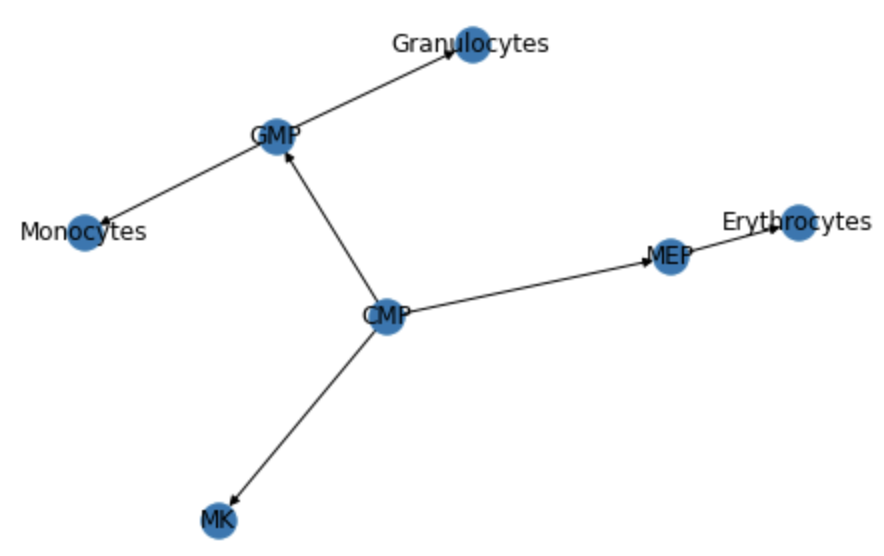
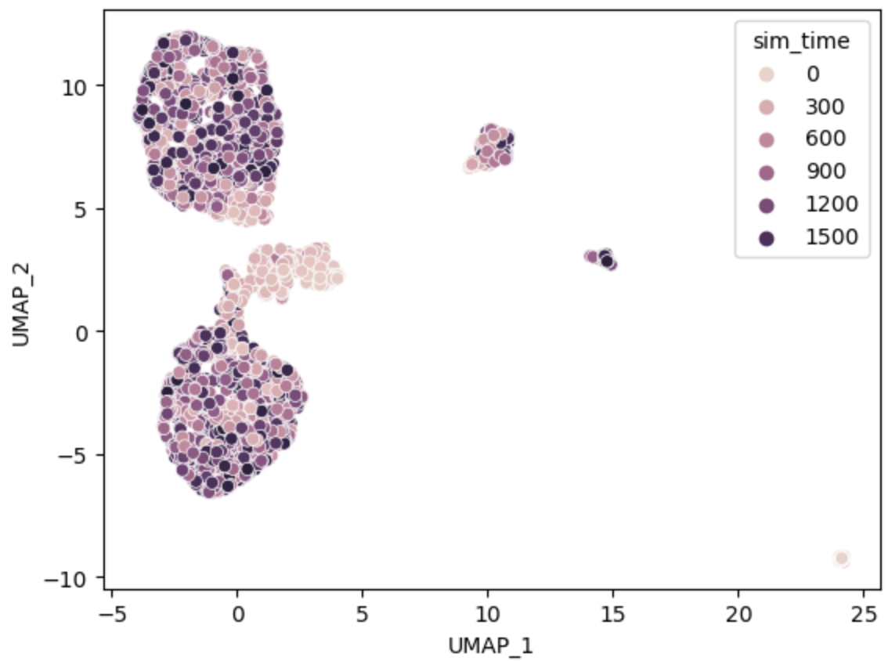
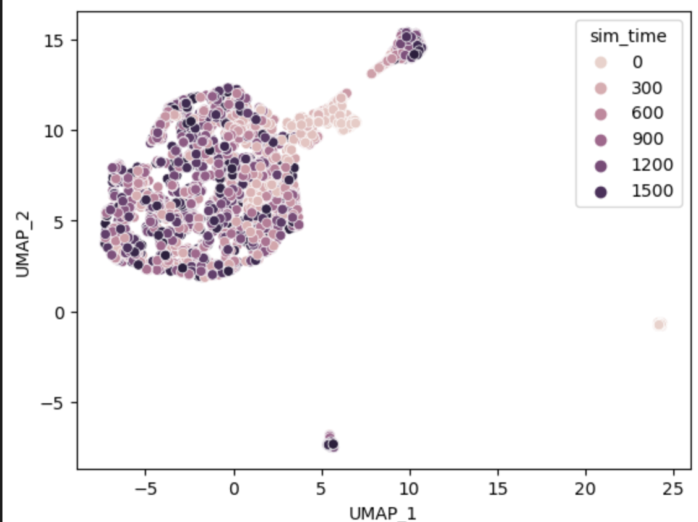

# OneSC (One Synthetic Cell) 

### <a name="introduction">Introduction</a>
OneSC is an computational tool for inferring and simulating core transcription factors circuits. 

Below is a walk-through tutorial on 
1. how to infer the transcription factors circuit
2. how to simulate synthetic single cells across developmental trajectories using the circuit 

### Table of contents

[Installation](#installation) <br>

[Inference of GRN](#grn_inference) <br>

[Simulation of Synthetic Cells](#simulate_syncells) <br>

[Visualization of Simulated Cells](#visualize_simcells) <br>

[Perform Perturbation Simulation](#perturb_syncells) <br>

[Optional - Identification of dynamic TFs](#identify_dyntfs)

### <a name="installation">Installation</a>
We recommend creating a new conda environment and install OneSC. Open terminal and type the following code. 
```
# type this into the terminal 
conda create -n OneSC_run 
conda activate OneSC_run 
```
In the conda environment, type the following code. 
```
# should be able to install onesc and the necessary dependencies. 
pip install git+https://github.com/CahanLab/oneSC.git
```
### <a name="grn_inference">Inference of GRN</a>
In the tutorial, we are going to use the mouse myeloid single-cell data from [Paul et al, 2015](https://www.cell.com/cell/fulltext/S0092-8674(15)01493-2?_returnURL=https%3A%2F%2Flinkinghub.elsevier.com%2Fretrieve%2Fpii%2FS0092867415014932%3Fshowall%3Dtrue). You can download the [expression profiles of core transcription factors](https://cnobjects.s3.amazonaws.com/OneSC/Pual_2015/train_exp.csv) and the [sample table](https://cnobjects.s3.amazonaws.com/OneSC/Pual_2015/samp_tab.csv) with pusedotime and cluster information. 

Import the required packages. 
```
import numpy as np 
import pandas as pd 
import onesc 
import networkx as nx
import pickle 
import seaborn as sns 
```

Load in the training data. 
```
train_exp = pd.read_csv("train_exp.csv", index_col = 0)
samp_tab = pd.read_csv("samp_tab.csv", index_col = 0)
pt_col = 'dpt_pseudotime'
cluster_col = 'cell_types'
```

Construct the cluster-cluster transition graph. 
```
initial_clusters = ['CMP']
end_clusters = ['Erythrocytes', 'Granulocytes', 'Monocytes', 'MK']
clusters_G = onesc.construct_cluster_network(train_exp, samp_tab, initial_clusters = initial_clusters, terminal_clusters = end_clusters, cluster_col = cluster_col, pseudo_col = pt_col)
```

We can visualize the networkx strcture of cluster-cluster transition graph. 
```
nx.draw(clusters_G, with_labels = True)
```


Identify the trajectories in the single-cell data using the cell state transition graph. 
```
# extract inidividual trajectories found in the data 
lineage_cluster = onesc.extract_trajectory(clusters_G,initial_clusters, end_clusters)
```
Identify the expression thresholds to binarize the expressions into activity status. 
```
# find the boolean threshold for each gene 
vector_thresh = onesc.find_threshold_vector(train_exp, samp_tab, cluster_col = "cell_types", cutoff_percentage=0.4)
```
Identify the pseudtime at which genes change activity status across different trajectories. 
```
# identify the finner time steps at which genes change along individual trajectory 
lineage_time_change_dict = onesc.find_gene_change_trajectory(train_exp, samp_tab, lineage_cluster, cluster_col, pt_col, vector_thresh, pseudoTime_bin=0.01) 
```
Generate the states activity profiles and the transition profiles for each cell type cluster. 
```
# define boolean states profiles for each cell cluster 
state_dict = onesc.define_states(train_exp, samp_tab, lineage_cluster, vector_thresh, cluster_col, percent_exp = 0.3)

# define transition profiles for each cell clusters
transition_dict = onesc.define_transition(state_dict)
```

Curate the training data for GRN inference. In short, it curates a activity status label for each target gene across different cell type state and regulators activity profiles for genetic algorithm optimization. 
```
# curate the training data for GRN inference for each gene 
training_data = onesc.curate_training_data(state_dict, transition_dict, lineage_time_change_dict, samp_tab, cluster_id = cluster_col, pt_id = pt_col,act_tolerance = 0.04)

# calculate the pearson correlation between genes. This adds more information during the inference step. 
corr_mat = onesc.calc_corr(train_exp)
```
Run the GRN inference step and save the GRN. To increase the number of networks inferred in the networks, please add more items to the *GA_seed_list* or *init_pop_seed*. 
```
# infer the gene regulatory network
ideal_edge_num = round(0.4 * corr_mat.shape[1])
grn_ensemble = onesc.create_network_ensemble(training_data, 
                                            corr_mat, 
                                            ideal_edges = ideal_edge_num, 
                                            num_generations = 300, 
                                            max_iter = 30, 
                                            num_parents_mating = 4, 
                                            sol_per_pop = 30, 
                                            reduce_auto_reg = True, 
                                            GA_seed_list = [1, 2, 3, 4, 5], 
                                            init_pop_seed_list = [21, 22, 23, 24, 25]) # this would generate 25 networks (one for each GA, init seed combo)

inferred_grn = grn_ensemble[0]
inferred_grn.to_csv("OneSC_network.csv")

# save the dictionary of Boolean states into a pickle object. 
# we will be needing the Boolean profiles of initial state for running simulations 
pickle.dump(state_dict, open("state_dict.pickle", "wb"))
```
You can print the inferred GRN out. It should look similar to something below. 
```
print(inferred_grn)

#       TF     TG Type
#0    Fli1  Cebpa    -
#1   Gata1  Cebpa    -
#2   Gfi1b  Cebpa    -
#3    Klf1  Cebpa    -
#4   Zfpm1  Cebpa    -
#5   Gata1  Cebpe    -
#6   Gata2  Cebpe    -
#7    Irf8  Cebpe    -
# ...
```
### <a name="simulate_syncells">Simulation of Synthetic Cells</a>
After inferring the gene regulatory network, we can perform simulations using the GRN as a backbone. First construct a OneSC simulator object using GRN. 
```
# load in the inferred GRNs 
inferred_grn = pd.read_csv("OneSC_network.csv", sep = ',', index_col=0)
MyNetwork = onesc.network_structure()
MyNetwork.fit_grn(inferred_grn)
MySimulator = onesc.OneSC_simulator()
MySimulator.add_network_compilation('Myeloid_network', MyNetwork)
```
Load in the state dict to get the Boolean profiles of the initial state 
```
# get the Boolean profiles of the initial state 
state_dict = pickle.load(open('state_dict.pickle', 'rb'))
init_state = state_dict['trajectory_0'].iloc[:, 0]
# put them into a dictionary 
init_exp_dict = dict()
for gene in init_state.index: 
    if init_state[gene] == 1:
        init_exp_dict[gene] = 2 # in the fitted grn, 2 is considered as fully turned on 
    else:
        init_exp_dict[gene] = 0
```
Here is one way to run one single simulation across time step. To create a different simulation trajectory, just change the random seed. 
```
rnd_seed = 1 # change the random seed to get  
temp_simulator.simulate_exp(init_exp_dict, 'Myeloid_network', num_sim = 1800, t_interval = 0.1, noise_amp = 0.5, random_seed = rnd_seed)
sim_exp = temp_simulator.sim_exp
print(sim_exp) 

#      0        1        2        3        4        5        6        7     \
#Cebpa    2  2.02423  1.94787  1.76007  1.72846  1.76987  1.77564  1.72405   
#Cebpe    0     0.02     0.02     0.02     0.02     0.02     0.02     0.02   
#Fli1     0     0.02  0.03973  0.05803    0.079  0.10201  0.10683   0.1294   
#Gata1    0     0.02     0.02     0.02     0.02     0.02     0.02     0.02   
...
```
Alternatively, you can use the wrapper function to simulate the expression profiles in parallel. This function has been tested on MacOS (m1 chip) and Ubuntu, it may or may not work on Windows. 

The code down below will create a output directory called *sim_profiles* where the simulations are saved. 
```
onesc.simulate_parallel(temp_simulator, init_exp_dict, 'Myeloid_network', n_cores = 10, output_dir = "sim_profiles", num_runs = 100, num_sim = 1800, t_interval = 0.1, noise_amp = 0.5)
```

### <a name="visualize_simcells">Visualization of Simulated Cells</a>
After we performed 100 simulations using the *onesc.simulate_parallel* function, if successful, we should be able to see the inidividual simulated expression profiles in the *sim_profiles* folder. 
```
save_folder_path = 'sim_profiles'
# list all the files in sim_profiles folder 
sim_files = os.listdir(save_folder_path)
print(sim_files)
# ['89_simulated_exp.csv', '59_simulated_exp.csv', '17_simulated_exp.csv', '71_simulated_exp.csv', '23_simulated_exp.csv', '45_simulated_exp.csv', '95_simulated_exp.csv', '12_simulated_exp.csv', ...]
```
Then we can load in all simulation results, sample them (every 50 simulation step to reduce computation) and the concanetate them into a giant dataframe. 
```
big_sim_df = pd.DataFrame()
for sim_file in sim_files: 
    experiment_title = sim_file.replace("_exp.csv", "")
    temp_sim = pd.read_csv(os.path.join(save_folder_path, sim_file), index_col = 0)
    temp_sim = temp_sim[temp_sim.columns[::50]] # sample every 50 simulated cells
    temp_sim.columns = experiment_title + "-" + temp_sim.columns
    big_sim_df = pd.concat([big_sim_df, temp_sim], axis = 1)
```
After getting the giant dataframe of individual simulated cell, we can embed them into UMAP coordinates and then visualize them. 
```
# embed the simulated cells into UMAP
train_obj = onesc.UMAP_embedding_train(big_sim_df)
UMAP_coord = onesc.UMAP_embedding_apply(train_obj, big_sim_df)
# add the simulation time step into the UMAP 
UMAP_coord['sim_time'] = [int(x.split("-")[1]) for x in list(UMAP_coord.index)]
sns.scatterplot(x='UMAP_1', y='UMAP_2', hue='sim_time', data=UMAP_coord)
```


### <a name="perturb_syncells">Perform Perturbation Simulation</a>
One of the main functions of OneSC is the capability of running in-silico perturbations. Here we are going to demonstrate how you can perform Cepbe in-silico knockout.

We first construct a perturb dictionary indicating which gene or genes we want to pertrub and how much do we perturb at each simulation step. The default maximum expression value is at 2 and the default minimum expression value is at 0. Therefore ff we want to perform in-silico overexpression, we would use values > 0 (i.e 1) and if we want to perform in-silico knockout, we would use values < 0 (i.e -1). 

```
perturb_dict = dict()
# manually subtract -1 on every simulation step to simulate knockout
perturb_dict['Cepbe'] = -1 
```
We would then pass the perturb dictionary as a parameter in *onesc.simulate_exp* function. Here is how we do it to run one single simulation.  
```
rnd_seed = 1 # set the random seed to be reproducible 
temp_simulator.simulate_exp(init_exp_dict, 'OneSC', perturb_dict, num_sim = 1800, t_interval = 0.1, noise_amp = 0.5, random_seed = rnd_seed)
sim_exp = temp_simulator.sim_exp.copy()
```
We can also pass the perturb dictionary as a parameter in *onesc.simulate_parallel* function to simulate in-silico perturbations in parallel. 
```
onesc.simulate_parallel(temp_simulator, init_exp_dict, 'OneSC', perturb_dict = perturb_dict, n_cores = 10, output_dir = "sim_profiles_CepbeKO", num_runs = 100, num_sim = 1800, t_interval = 0.1, noise_amp = 0.5)
```
Lastly, you can visualize the results in UMAP 
```
save_folder_path = 'sim_profiles_CepbeKO'
sim_files = os.listdir(save_folder_path)
print(sim_files)

big_sim_df = pd.DataFrame()
for sim_file in sim_files: 
    experiment_title = sim_file.replace("_exp.csv", "")
    temp_sim = pd.read_csv(os.path.join(save_folder_path, sim_file), index_col = 0)
    temp_sim = temp_sim[temp_sim.columns[::50]] # probably have to do it every 10 cells 
    temp_sim.columns = experiment_title + "-" + temp_sim.columns
    big_sim_df = pd.concat([big_sim_df, temp_sim], axis = 1)

# embed the simulated cells into UMAP
train_obj = onesc.UMAP_embedding_train(big_sim_df)
UMAP_coord = onesc.UMAP_embedding_apply(train_obj, big_sim_df)
# add the simulation time step into the UMAP 
UMAP_coord['sim_time'] = [int(x.split("-")[1]) for x in list(UMAP_coord.index)]
sns.scatterplot(x='UMAP_1', y='UMAP_2', hue='sim_time', data=UMAP_coord)
```


### <a name="identify_dyntfs">Optional - Identification of dynamic TFs</a>
OneSC also has a built-in function that allows the user to identify important dynamically expressed transcription factors for the downstream GRN inference. This method was an adaptation from [Su et al, 2022](https://www.sciencedirect.com/science/article/pii/S2213671121006573?via%3Dihub). If the user knows the key transcription factors important for development in the biological system of interest, then feel free to use those genes and skip this step. 

First download the processed and cell-typed anndata of [Paul et al dataset](https://cnobjects.s3.amazonaws.com/OneSC/Pual_2015/filtered_adata.h5ad) and [mouse TFs list](https://cnobjects.s3.amazonaws.com/OneSC/mmTFs/Mus_musculus_TF.txt). The list of mouse TFs were downloaded from [Animal TFDB v4.0](https://guolab.wchscu.cn/AnimalTFDB4/#/) ([Shen et al, 2023](https://academic.oup.com/nar/article/51/D1/D39/6765312?login=true)). To see the scanpy workflow of preprocessing, clustering and cell typing the data, please see [this file](https://cnobjects.s3.amazonaws.com/OneSC/preprocessing_scripts/celltype_myeloid.py). 

First load in the mouse transcription factors and the cell-type annotated anndata. 
```
import numpy as np 
import pandas as pd
import onesc 
import scanpy as sc

# load in the mouse TFs and anndata
mmTFs = pd.read_csv("Mus_musculus_TF.txt", sep = '\t')
mmTFs_list = list(mmTFs['Symbol'])
test_adata = sc.read_h5ad("filtered_adata.h5ad")
```
Extract out the sample table and expression profiles. 

```
samp_tab = test_adata.obs
exp_tab = test_adata.raw.to_adata().to_df()
exp_tab = exp_tab.T
```
Identify the different trajectories in the single-cell data. 
```
trajectory_dict = dict()
trajectory_dict['T1'] = ['CMP', 'MEP', 'Erythrocytes']
trajectory_dict['T2'] = ['CMP', 'GMP', 'Granulocytes']
trajectory_dict['T3'] = ['CMP', 'GMP', 'Monocytes']
trajectory_dict['T4'] = ['CMP', 'MK']

```
Indicate the column name for the clusters/cell type information and pseudotime ordering. 
```
cluster_col = 'cell_types'
pt_col = 'dpt_pseudotime'

my_df = onesc.suggest_dynamic_genes(exp_tab.loc[exp_tab.index.isin(mmTFs_list), :].copy(), samp_tab, trajectory_dict, cluster_col, pt_col, adj_p_cutoff = 0.05, log2_change_cutoff = 3, min_exp_cutoff = 0.4)
interesting_TFs = np.unique(my_df.index)
print(interesting_TFs)
# ['Cebpa' 'Cebpe' 'Fli1' 'Gata1' 'Gata2' 'Gfi1b' 'Irf8' 'Klf1' 'Mef2c'
 'Pbx1' 'Sox4' 'Zfpm1']
```