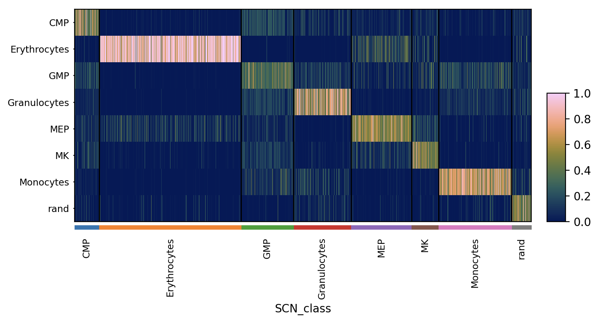

# OneSC (One Synthetic Cell) 

### <a name="introduction">Introduction</a>
OneSC is an computational tool for inferring and simulating core transcription factors circuits. 

Below is a walk-through tutorial on 
1. how to infer the transcription factors circuit
2. how to simulate synthetic single cell expression states across pseudotemporal trajectories using the circuit 

### Table of contents

1. [Installation](#installation) 
2. [Example data](#data)
3. [Setup](#setup)
4. [GRN inference](#grn_inference)
5. [Setup simulator](#setup_simulator)
6. [Simulate wildtype trajectory](#simulate_wildtype)
7. [Simulate knockout trajectory](#simulate_knockout)
8. [Optional - Identification of dynamic TFs](#identify_dyntfs)

### <a name="installation">Installation</a>
We recommend creating a new conda environment (with python version >= 3.9) and install OneSC. Open terminal and type the following code. 
```
# type this into the terminal 
conda create -n OneSC_run python
conda activate OneSC_run 
```
In the conda environment, type the following code. 
```
# should be able to install onesc and the necessary dependencies. 
pip install git+https://github.com/pcahan1/oneSC.git@cscb24
```

### <a name="data">Example data</a>
In the tutorial, we are going to use the mouse myeloid single-cell data from [Paul et al, 2015](https://pubmed.ncbi.nlm.nih.gov/26627738/). We have refined the annotation of these 2,670 cells. Please download the [h5ad file containing the expression values of 12 core transcription factors in these cells here](https://cnobjects.s3.amazonaws.com/OneSC/0.1.0/Paul15_040824.h5ad). Note that this annData object includes cell type annotation and precomputed pseudotime metadata in adata.obs['cell_types'] and adata.obs['dpt_pseudotime'], respectively.  

### <a name="setup">Setup</a>

Launch Jupyter or your Python interpreter. Import the required packages and functions. 
```
import numpy as np 
import pandas as pd 
import onesc 
import networkx as nx
import seaborn as sns
import matplotlib.pyplot as plt
import os
import scanpy as sc
import anndata
import scipy as sp
import pySingleCellNet as pySCN
from joblib import dump, load
import sys
import igraph as ig
from igraph import Graph
ig.config['plotting.backend'] = 'matplotlib'
```

Load in the training data:
```
adata = sc.read_h5ad("Paul15_040824.h5ad")
```

We will use PySCN later to annotate the states of the simulated cells. Train the classifer now:
```
adTrain_rank, adHeldOut_rank = pySCN.splitCommonAnnData(adata, ncells=50,dLevel="cell_types")
clf = pySCN.train_rank_classifier(adTrain_rank, dLevel="cell_types")
```

Classify held out data:
```
pySCN.rank_classify(adHeldOut_rank, clf)
pySCN.heatmap_scores(adHeldOut_rank, groupby='SCN_class')
```



Note: the function `train_rank_classifier()` ranks transforms training and query data instead of TSP. Be forewarned that it is likely to be slow if applied to adata objects with thousands of genes. 


### <a name="grn_inference">GRN Inference</a>

The first step in reconstructing or inferring a GRN with oneSC is to determine the directed state graph of the cells. In other words, what is the sequence of distinct states that a cell passes through from the start to a terminal state? oneSC requires that the user provide cell state annotations. Typically these are in the form of cell clusters or cell type annotations. oneSC also requires that the user specify the initial cell states and the end states. In our data, the cell states have already been provided in  .obs['cell_types']. Now, we will specify the initial cell states and the end states:
```
initial_clusters = ['CMP']
end_clusters = ['Erythrocytes', 'Granulocytes', 'Monocytes', 'MK']
```

We can use oneSC to infer the directed state graph since it knows the initial and terminal states and the pseudotime of all cells:
```
state_path = onesc.construct_cluster_graph_adata(adata, initial_clusters = initial_clusters, terminal_clusters = end_clusters, cluster_col = "cell_types", pseudo_col = "dpt_pseudotime")

onesc.plot_state_graph(state_path)
```


However, you can also manually create a directed state graph:
```
edge_list = [("CMP", "MK"), ("CMP", "MEP"), ("MEP", "Erythrocytes"), ("CMP", "GMP"), ("GMP", "Granulocytes"), ("GMP", "Monocytes")]
H = nx.DiGraph(edge_list)
onesc.plot_state_graph(H)
```


Now we are ready to infer the GRN. There are quite a few parameters to `infer_grn()`. Listed below are required parameters, and those that you can adjust to optimize runtime on your platform. In the example below, we have selected parameter values appropriate for this data.

- cellstate_graph: this is just the state graph we made earlier, H.
- start_end_clusters: a dict of 'start', and 'end' cell states.
- adata: the training data.
- run_parallel: (bool, optional): whether to run network inference in parallel. Defaults to True
- n_cores (int, optional): number of cores to run the network inference in parallel. Defaults to 16

infer_grn() returns a Pandas DataFrame. We convert it to an igraph graph for visualization.

```
start_end_states = {'start': ['CMP'], 'end':['MK', 'Erythrocytes', 'Granulocytes', 'Monocytes']}

iGRN = onesc.infer_grn(H, start_end_states, adata, num_generations = 20, sol_per_pop = 30, reduce_auto_reg=True, ideal_edges = 0, GA_seed_list = [1, 3], init_pop_seed_list = [21, 25], cluster_col='cell_types', pseudoTime_col='dpt_pseudotime')

grn_ig = onesc.dataframe_to_igraph(iGRN)
onesc.plot_grn(grn_ig, layout_method='fr',community_first=True)
```


The purple edges represent positive regulatory relationships (i.e. TF promotes expression of TG), whereas grey edges represent inhibitory relationships. Nodes have been colored by a community detection algorithm applied to the GRN.

### <a name="setup_simulator">Setup simulator</a>
For all simulations, we need to define the start state. In our case, we know that cells start in the CMP state. To determine the Boolean state of genes in the CMP state, we subset the adata to those cells and then apply thresholds on the mean expression and the percent of cells in which the gene is detected: 
```
adCMP = adata[adata.obs['cell_types'] == 'CMP'].copy()
xstates = onesc.define_states_adata(adCMP, min_mean = 0.05, min_percent_cells = 0.20) * 2 
```
Note: oneSC has other, more sophisticated approaches to achieve this that are not yet compatible with annData.

Now we construct a OneSC simulator object:
```
netname = 'CMPdiff'
netsim = onesc.network_structure()
netsim.fit_grn(iGRN)
sim = onesc.OneSC_simulator()
sim.add_network_compilation(netname, netsim)
```

### <a name="simulate_wildtype">Simulate wild type trajectory</a>
Finally we are ready to simulate expression state trajectories using our GRN. Note that the `simulate_parallel_adata` function has been tested on MacOS (m1 chip) and Ubuntu, it may or may not work on Windows. 

- OneSC_simulator: exactly that, the OneSC simulator object to use. 
- initial_exp_dict (dict): dictionary of initial state values.
- initial_subnet (str): the name of the gene regulatory fitted network structure that the user want to use for simulation. 
- perturb_dict (dict, optional): a dictionary with the key of gene name and value indicating the in silico perturbation. If the user want to perform overexpression, then set the value between 0 and 2. If the user want to perform knockdown, then set the value between 0 and -2. Defaults to dict().
- num_runs (int, optional): number of simulations to run. Defaults to 10.
- n_cores (int, optional): number of cores for parallel computing. Defaults to 2.
- num_sim (int, optional): number of simulation steps. Defaults to 1000.
- t_interval (float, optional): the size of the simulation step. Defaults to 0.01.
- noise_amp (int, optional): the amplitude of noise. Defaults to 0.1

```
simlist_wt = onesc.simulate_parallel_adata(sim, xstates, netname, n_cores = 8, num_sim = 1000, num_runs = 32, t_interval = 0.1, noise_amp = 0.5)
```

`simulate_parallel_adata` returns a list of annData objects. Each annData contains `num_sim` simulated cells starting at the `initial_exp_dict` state, and progressing subject to the regulatory constraints defined by the provided GRN modulated by randomly generated noise (if allowed). Each annData has .obs['sim_time']. Let's look at the transcriptomic states over sim_time for one simulated trajectory. We will classify the cells first, and then visualize

```
ad_sim1 = simlist_wt[0].copy()
pySCN.rank_classify(ad_sim1, clf)

# a hack because sc.pl.heatmap requires a 'groupby', so groupby simulation time bin
tmp_obs = ad_sim1.obs.copy()
bins = np.linspace(-1, 999, 11)
labels = [f"{int(bins[i]) + 1}-{int(bins[i+1])}" for i in range(len(bins)-1)]

tmp_obs['sTime_bin'] = pd.cut(tmp_obs['sim_time'], bins=bins, labels=labels)
ad_sim1.obs = tmp_obs

pySCN.heatmap_scores(ad_sim1, groupby = 'sTime_bin')
```


Instead of looking the trajectory of a single cell, we can sample the end stages of all simulations:
```
ad_wt = onesc.sample_and_compile_anndatas(simlist_wt, X=50, time_bin=(80, 100), sequential_order_column='sim_time')
pySCN.rank_classify(ad_wt, clf)
pySCN.heatmap_scores(ad_wt, groupby = 'SCN_class')
```


### <a name="simulate_knockout">Simulate knockout trajectory</a>
Now, let's simulate a trajectory of a cell in which Cebpa is knocked out
```
perturb_dict = dict()
perturb_dict['Cebpa'] = -1 
simlist_cebpa_ko = onesc.simulate_parallel_adata(sim, xstates, 'CMPdiff', perturb_dict = perturb_dict, n_cores = 8, num_sim = 1000, t_interval = 0.1, noise_amp = 0.5)
```

Now fetch the simulated cells, sampling from the end stages, classify them, and visualize the results.
```
ad_cebpa_ko = onesc.sample_and_compile_anndatas(simlist_cebpa_ko, X=50, time_bin=(80, 100), sequential_order_column='sim_time')
pySCN.rank_classify(ad_cebpa_ko, clf)
pySCN.heatmap_scores(ad_cebpa_ko, groupby = 'SCN_class')
```


We can also directly compare the proportions of cell types across simulations/perturbations as follows:
```
pySCN.plot_cell_type_proportions([adHeldOut_rank,ad_wt, ad_cebpa_ko], obs_column = "SCN_class", labels=["HeldOut", "WT","Cebpa_KO"])
```


### <a name="identify_dyntfs">Optional - Identification of dynamic TFs</a>
OneSC also has a built-in function that allows the user to identify important dynamically expressed transcription factors for the downstream GRN inference. This method was an adaptation from [Su et al, 2022](https://www.sciencedirect.com/science/article/pii/S2213671121006573?via%3Dihub). If the user knows the key transcription factors important for development in the biological system of interest, then feel free to use those genes and skip this step. 

First download the processed and cell-typed anndata of [Paul et al dataset](https://cnobjects.s3.amazonaws.com/OneSC/Pual_2015/filtered_adata.h5ad) and [mouse TFs list](https://cnobjects.s3.amazonaws.com/OneSC/mmTFs/Mus_musculus_TF.txt). The list of mouse TFs were downloaded from [Animal TFDB v4.0](https://guolab.wchscu.cn/AnimalTFDB4/#/) ([Shen et al, 2023](https://academic.oup.com/nar/article/51/D1/D39/6765312?login=true)). To see the scanpy workflow of preprocessing, clustering and cell typing the data, please see [this file](https://cnobjects.s3.amazonaws.com/OneSC/preprocessing_scripts/celltype_myeloid.py). 

First load in the mouse transcription factors and the cell-type annotated anndata. 
```
import numpy as np 
import pandas as pd
import onesc 
import scanpy as sc

# load in the mouse TFs and anndata
mmTFs = pd.read_csv("Mus_musculus_TF.txt", sep = '\t')
mmTFs_list = list(mmTFs['Symbol'])
test_adata = sc.read_h5ad("filtered_adata.h5ad")
```
Extract out the sample table and expression profiles. 

```
samp_tab = test_adata.obs
exp_tab = test_adata.raw.to_adata().to_df()
exp_tab = exp_tab.T
```
Identify the different trajectories in the single-cell data. 
```
trajectory_dict = dict()
trajectory_dict['T1'] = ['CMP', 'MEP', 'Erythrocytes']
trajectory_dict['T2'] = ['CMP', 'GMP', 'Granulocytes']
trajectory_dict['T3'] = ['CMP', 'GMP', 'Monocytes']
trajectory_dict['T4'] = ['CMP', 'MK']

```
Indicate the column name for the clusters/cell type information and pseudotime ordering. 
```
cluster_col = 'cell_types'
pt_col = 'dpt_pseudotime'

my_df = onesc.suggest_dynamic_genes(exp_tab.loc[exp_tab.index.isin(mmTFs_list), :].copy(), samp_tab, trajectory_dict, cluster_col, pt_col, adj_p_cutoff = 0.05, log2_change_cutoff = 3, min_exp_cutoff = 0.4)
interesting_TFs = np.unique(my_df.index)
print(interesting_TFs)
# ['Cebpa' 'Cebpe' 'Fli1' 'Gata1' 'Gata2' 'Gfi1b' 'Irf8' 'Klf1' 'Mef2c'
 'Pbx1' 'Sox4' 'Zfpm1']
```