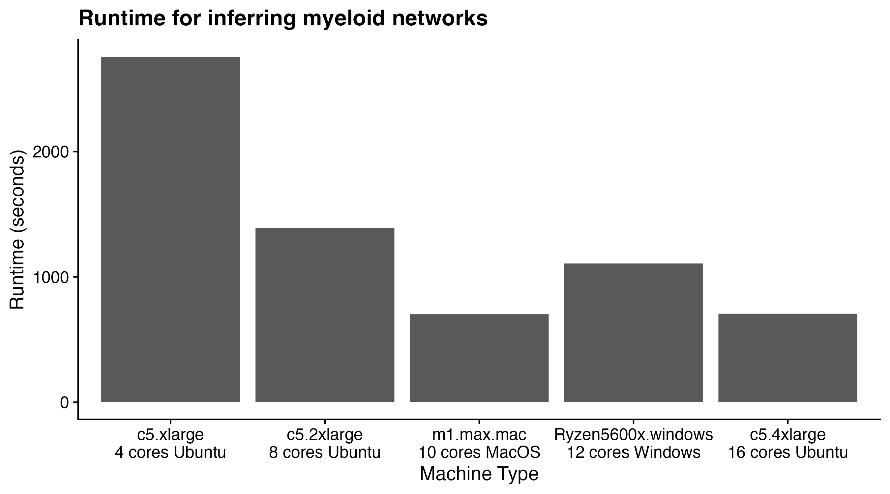

# Inference of functional transcription factors network
In the tutorial, we are going to use the mouse myeloid single-cell data from [Paul et al, 2015](https://www.cell.com/cell/fulltext/S0092-8674(15)01493-2?_returnURL=https%3A%2F%2Flinkinghub.elsevier.com%2Fretrieve%2Fpii%2FS0092867415014932%3Fshowall%3Dtrue). You can download the [expression profiles of 12 core transcription factors](https://cnobjects.s3.amazonaws.com/OneSC/Paul_2015/train_exp.csv) and the [sample table](https://cnobjects.s3.amazonaws.com/OneSC/Paul_2015/samp_tab.csv) with pusedotime and cluster information. 

### Setup
Launch Jupyter or your Python interpreter. Import the required packages and functions.
```
import numpy as np 
import pandas as pd 
import onesc 
import networkx as nx
import pickle 
import seaborn as sns 
import matplotlib.pyplot as plt
import os
```

Load in the training data. Note that the sample_tab.csv includes cell type annotation and precomputed pseudotime metadata in the column 'cell_types' and column 'dpt_pseudotime' (pseudotime should scaled to be between 0 and 1), respectively. 
```
train_exp = pd.read_csv("train_exp.csv", index_col = 0)
samp_tab = pd.read_csv("samp_tab.csv", index_col = 0)
pt_col = 'dpt_pseudotime'
cluster_col = 'cell_types'
```
*Important notice*: Make sure there are no underscore "_" in any of the cell cluster annotations. 
### GRN inference 
There are a few steps that needs to be taken before we could use OneSC to infer GRNs. The first step in reconstructing or inferring a GRN with oneSC is to determine the directed state graph of the cells. In other words, what is the sequence of distinct states that a cell passes through from the start to a terminal state? oneSC requires that the user provide cell state annotations. Typically these are in the form of cell clusters or cell type annotations. oneSC also requires that the user specify the initial cell states and the end states. In our data, the cell states have already been provided in 'cell_types' column in 'samp_tab'. Now, we will specify the initial cell states and the end states:

```
initial_clusters = ['CMP']
end_clusters = ['Erythrocytes', 'Granulocytes', 'Monocytes', 'MK']
```
We can use oneSC to infer the directed state graph since it knows the initial and terminal states and the pseudotime of all cells:
```
state_path = onesc.construct_cluster_network(train_exp, samp_tab, initial_clusters = initial_clusters, terminal_clusters = end_clusters, cluster_col = cluster_col, pseudo_col = pt_col)
onesc.plot_state_graph(state_path)
```


However, we can also manually create a directed state graph:

```
edge_list = [("CMP", "MK"), ("CMP", "MEP"), ("MEP", "Erythrocytes"), ("CMP", "GMP"), ("GMP", "Granulocytes"), ("GMP", "Monocytes")]
state_path = nx.DiGraph(edge_list)
```

Next we identify the trajectories in the single-cell data from the cell state transition graph. This helps us identify the cell states along individual trajectories in the single-cell data. 
```
lineage_cluster = onesc.extract_trajectory(state_path,initial_clusters, end_clusters)
```
We find the expression thresholds to binarize the expressions into activity status and identify the pseudotime at which genes change activity status across different trajectories. The orders at which different genes change activity status help us refine the casual relationships between regulators and regulons downstream during the GRN inference step. 
```
# find the boolean threshold for each gene 
vector_thresh = onesc.find_threshold_vector(train_exp, samp_tab, cluster_col = "cell_types", cutoff_percentage=0.4)

# identify the finner time steps at which genes change along individual trajectory 
lineage_time_change_dict = onesc.find_gene_change_trajectory(train_exp, samp_tab, lineage_cluster, cluster_col, pt_col, vector_thresh, pseudoTime_bin=0.01) 
```
Next we generate the states activity profiles and the transition profiles for each cell state. 
```
# define boolean states profiles for each cell cluster 
state_dict = onesc.define_states(train_exp, samp_tab, lineage_cluster, vector_thresh, cluster_col, percent_exp = 0.3)

# save the dictionary of Boolean states into a pickle object. 
# we will be needing the Boolean profiles of initial state for running simulations 
pickle.dump(state_dict, open("state_dict.pickle", "wb"))

# define transition profiles for each cell clusters
transition_dict = onesc.define_transition(state_dict)
```
Lastly we curate all the data required for training a GRN using genetic algorithm optimization. In the training data for each gene, there are the activity status for the target gene across different cell states acting as labels and a corresponding activity status profiles of all potential regulators across different cell states acting as features. The goal for the genetic algorithm is to optimize a network configuration for each target gene and its regulators such that upon Boolean simulations using the activity status of its regulators, there is a maximum level of agreement between the simulated activity status for the target gene across cell states and the observed activity status for the target gene across cell states. During the construction of the training data, OneSC uses the pseudotime ordering at which genes change activity (defined earlier) to finetune the potential regulators activity status profiles such that it most accurately reflect scenerios at which genes change activity status during cell state transition. We also calculated the pearson correlation between genes as additional information during GRN reconstruction. 
```
# curate the training data for GRN inference for each gene 
training_data = onesc.curate_training_data(state_dict, transition_dict, lineage_time_change_dict, samp_tab, cluster_id = cluster_col, pt_id = pt_col,act_tolerance = 0.04)

# calculate the pearson correlation between genes. This adds more information during the inference step. 
corr_mat = onesc.calc_corr(train_exp)
```
Then we run the GRN inference using genetic algorithm. Inherently, there is stochasticity in genetic algorithm such that different inital populations and different optimization can affect the outcomes. To ensure our results are robust to variations in initial populations or optimization steps, OneSC will generate an ensemble of GRNs acorss different seed combinations for initial populations and optimization steps. Then OneSC will generate a final GRN using the majority network configurations in the ensemble. 

To increase the number of networks inferred in the ensemble, please add more items to the *GA_seed_list* or *init_pop_seed*. 
```
# infer the gene regulatory network
ideal_edge_num = round(0.4 * corr_mat.shape[1])
grn_ensemble = onesc.create_network_ensemble(training_data, 
                                            corr_mat, 
                                            ideal_edges = ideal_edge_num, 
                                            num_generations = 300, 
                                            max_iter = 30, 
                                            num_parents_mating = 4, 
                                            sol_per_pop = 30, 
                                            reduce_auto_reg = True, 
                                            GA_seed_list = [1, 2, 3, 4, 5], 
                                            init_pop_seed_list = [21, 22, 23, 24, 25]) # this would generate 25 networks (one for each GA, init seed combo)

inferred_grn = grn_ensemble[0]
inferred_grn.to_csv("OneSC_network.csv")
```
You can print the inferred GRN out. It should look similar to something below. 
```
print(inferred_grn)

#       TF     TG Type
#0    Fli1  Cebpa    -
#1   Gata1  Cebpa    -
#2   Gfi1b  Cebpa    -
#3    Klf1  Cebpa    -
#4   Zfpm1  Cebpa    -
#5   Gata1  Cebpe    -
#6   Gata2  Cebpe    -
#7    Irf8  Cebpe    -
# ...
```

### Approximate runtime for different machines 
To provide users with an estimate of the time required for inferring myeloid networks, we run GRN inference on various AWS EC2 instances (c5.xlarge, c5.2xlarge, c5.4xlarge) and on personal computers running Mac and Windows. The image below hopefully provides some help. 


