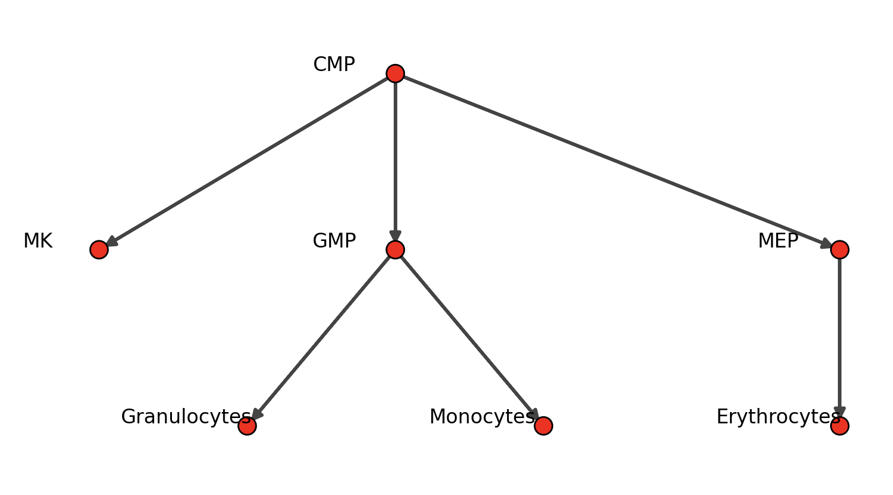
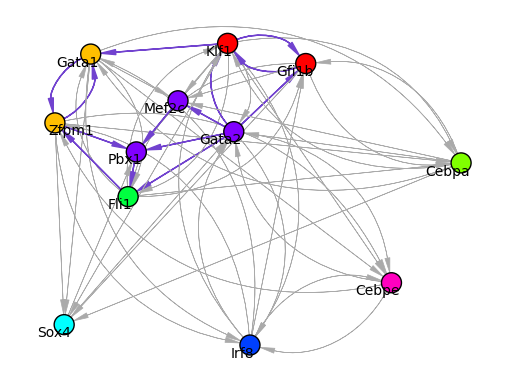
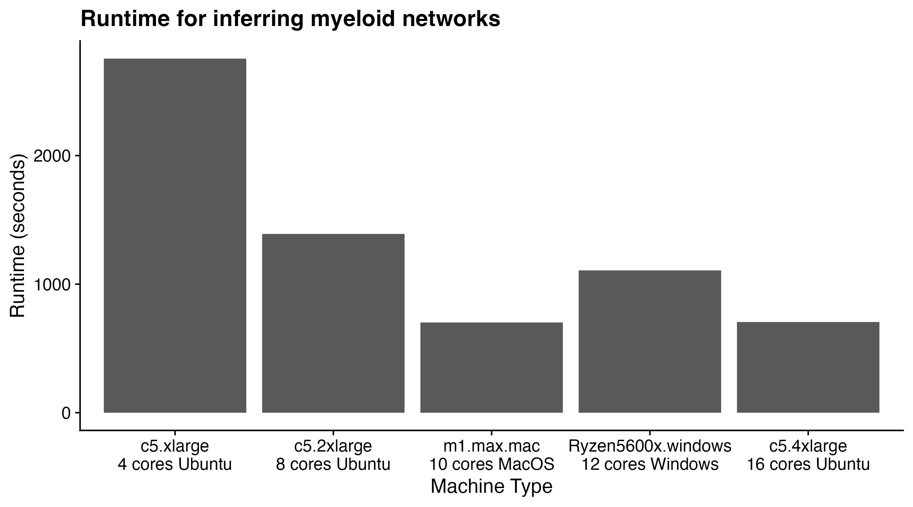

# Inference of functional transcription factors network (AnnData Object)
In this tutorial, we are going to show how to run OneSC from AnnData object. We are going to use the mouse myeloid single-cell data from [Paul et al, 2015](https://pubmed.ncbi.nlm.nih.gov/26627738/). We have refined the annotation of these 2,670 cells. Please download the h5ad file containing the expression values of 12 core transcription factors in these cells [here](https://cnobjects.s3.amazonaws.com/OneSC/Paul_2015/Paul15_040824_filtered.h5ad). Note that this annData object includes cell type annotation and precomputed pseudotime metadata in adata.obs['cell_types'] and adata.obs['dpt_pseudotime'] (pseudotime should scaled to be between 0 and 1), respectively. Part of this tutorial will use the package [pySingleCellNet](https://pysinglecellnet.readthedocs.io/en/latest/).  

### Setup
Launch Jupyter or your Python interpreter. Import the required packages and functions.
```
import numpy as np 
import pandas as pd 
import onesc 
import networkx as nx
import seaborn as sns
import matplotlib.pyplot as plt
import os
import scanpy as sc
import anndata
import scipy as sp
import pySingleCellNet as pySCN
from joblib import dump, load
import sys
import igraph as ig
from igraph import Graph
ig.config['plotting.backend'] = 'matplotlib'
```

Load in the training data:
```
adata = sc.read_h5ad("Paul15_040824.h5ad")
```
*Important notice*: Make sure there are no underscore "_" in any of the cell cluster annotations. 

### GRN inference 
The first step in reconstructing or inferring a GRN with oneSC is to determine the directed cell state transition graph of the cells. In other words, what is the sequence of distinct states that cells pass through from the start to a terminal state? OneSC requires that the user provide cell state annotations. Typically these are in the form of cell clusters or cell type annotations. OneSC also requires that the user specify the initial cell states and the end states. In our data, the cell states have already been provided in  .obs['cell_types']. Now, we will specify the initial cell states and the end states:
```
initial_clusters = ['CMP']
end_clusters = ['Erythrocytes', 'Granulocytes', 'Monocytes', 'MK']
```

We can use OneSC to infer the directed cell states transition graph since it knows the initial and terminal states and the pseudotime of all cells:
```
state_path = onesc.construct_cluster_graph_adata(adata, initial_clusters = initial_clusters, terminal_clusters = end_clusters, cluster_col = "cell_types", pseudo_col = "dpt_pseudotime")

onesc.plot_state_graph(state_path)
```



However, you can also manually create a directed state graph:
```
edge_list = [("CMP", "MK"), ("CMP", "MEP"), ("MEP", "Erythrocytes"), ("CMP", "GMP"), ("GMP", "Granulocytes"), ("GMP", "Monocytes")]
H = nx.DiGraph(edge_list)
onesc.plot_state_graph(H)
```

Now we are ready to infer the GRN. There are quite a few parameters to `infer_grn()`. Listed below are required parameters, and those that you can adjust to optimize runtime and performance on your platform. In the example below, we have selected parameter values appropriate for this data.

- cellstate_graph: this is just the state graph we made earlier, H.
- start_end_clusters: a dict of 'start', and 'end' cell states.
- adata: the training data.
- n_cores (int, optional): number of cores to run the network inference in parallel. Defaults to 16
- GA_seed_list (list, optional): a list of seeds used for GA to be reproducible during the ensemble inference of GRNs
- init_pop_seed_list (list, optional): a list of seeds to generate initial population of subnetworks during the ensemble inference of GRNs 
- act_tolerance (float, optional): the pseudotime window in which if a transcription factor change status earlier than the pseudotime window before the target gene change status, then the transcription factor is recorded to change activity status before the target gene. This helps finetune the Boolean activity status of regulator profiles and target gene activity status when target gene and transcription factor both change status during cell state transition. Typically this number is 1/3-1/5 of the smallest psuedotime difference between two adjuscent cell clusters. Defaults to 0.04.

infer_grn() returns a Pandas DataFrame. We convert it to an igraph graph for visualization.

```
start_end_states = {'start': ['CMP'], 'end':['MK', 'Erythrocytes', 'Granulocytes', 'Monocytes']}

iGRN = onesc.infer_grn(H, 
                       start_end_states, 
                       adata, 
                       cluster_col='cell_types', 
                       pseudoTime_col='dpt_pseudotime',
                       ideal_edge_percent = 0.4, 
                       GA_seed_list = [1, 2, 3, 4, 5], 
                       init_pop_seed_list = [21, 22, 23, 24, 25], 
                       n_cores = 16, 
                       act_tolerance = 0.04)

grn_ig = onesc.dataframe_to_igraph(iGRN)
onesc.plot_grn(grn_ig, layout_method='fr',community_first=True)
```


The purple edges represent positive regulatory relationships (i.e. TF promotes expression of TG), whereas grey edges represent inhibitory relationships. Nodes have been colored by a community detection algorithm applied to the GRN.

### Approximate runtime for different machines 
To provide users with an estimate of the time required for inferring the myeloid network, we ran GRN inference on various AWS EC2 instances (c5.xlarge, c5.2xlarge, c5.4xlarge) and on personal computers running Mac and Windows using different CPUs. The plot below hopefully provides some guidance. 

