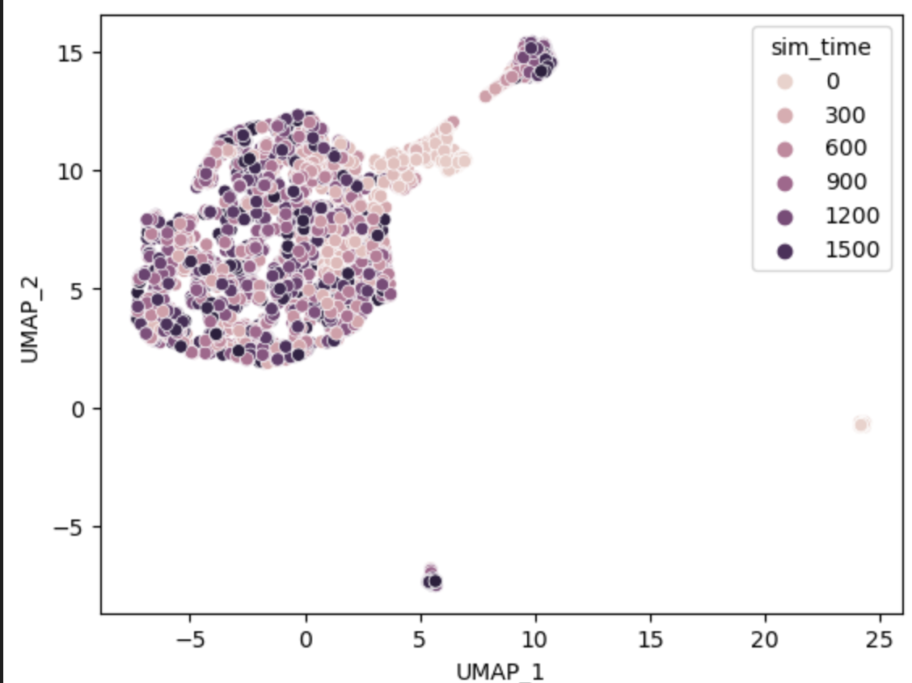

# Simulation of Synthetic Cells 

### Building OneSC simulator 
After the inference of GRNs from [previous step](infer_grn.md), we can perform simulations using the GRN as a backbone. First construct a OneSC simulator object using GRN. 
```
# load in the inferred GRNs 
inferred_grn = pd.read_csv("OneSC_network.csv", sep = ',', index_col=0)
MyNetwork = onesc.network_structure()
MyNetwork.fit_grn(inferred_grn)
MySimulator = onesc.OneSC_simulator()
MySimulator.add_network_compilation('Myeloid_network', MyNetwork)
```
Then we can load in the state dict generated from [previous step](infer_grn.md) to get the Boolean activity profiles of the initial state. 
```
# get the Boolean profiles of the initial state 
state_dict = pickle.load(open('state_dict.pickle', 'rb'))
init_state = state_dict['trajectory_0'].iloc[:, 0]
# put them into a dictionary 
init_exp_dict = dict()
for gene in init_state.index: 
    if init_state[gene] == 1:
        init_exp_dict[gene] = 2 # in the fitted grn, 2 is considered as fully turned on 
    else:
        init_exp_dict[gene] = 0
```
We can run one single stochastic simulations. To create another trajectory simulation, we just have to change the random seed. 
```
rnd_seed = 1 # change the random seed to get  
MySimulator.simulate_exp(init_exp_dict, 'Myeloid_network', num_sim = 1800, t_interval = 0.1, noise_amp = 0.5, random_seed = rnd_seed)
sim_exp = MySimulator.sim_exp
print(sim_exp) 

#      0        1        2        3        4        5        6        7     \
#Cebpa    2  2.02423  1.94787  1.76007  1.72846  1.76987  1.77564  1.72405   
#Cebpe    0     0.02     0.02     0.02     0.02     0.02     0.02     0.02   
#Fli1     0     0.02  0.03973  0.05803    0.079  0.10201  0.10683   0.1294   
#Gata1    0     0.02     0.02     0.02     0.02     0.02     0.02     0.02   
...
```
Alternatively, we can use the wrapper function to simulate the expression profiles in parallel. This function has been tested on MacOS (m1 chip) and Ubuntu, it may or may not work on Windows.

The code down below will create a output directory called sim_profiles where the simulations are saved.
```
onesc.simulate_parallel(MySimulator, init_exp_dict, 'Myeloid_network', n_cores = 10, output_dir = "sim_profiles", num_runs = 100, num_sim = 1800, t_interval = 0.1, noise_amp = 0.5)
```

### Visualization of Simulated Cells 
After we performed 100 simulations using the onesc.simulate_parallel function, if successful, we should be able to see the inidividual simulated expression profiles in the sim_profiles folder.
```
save_folder_path = 'sim_profiles'
# list all the files in sim_profiles folder 
sim_files = os.listdir(save_folder_path)
print(sim_files)
# ['89_simulated_exp.csv', '59_simulated_exp.csv', '17_simulated_exp.csv', '71_simulated_exp.csv', '23_simulated_exp.csv', '45_simulated_exp.csv', '95_simulated_exp.csv', '12_simulated_exp.csv', ...]
```
Then we can load in all simulation results, sample them (every 50 simulation step to reduce computation) and the concanetate them into a giant dataframe.
```
big_sim_df = pd.DataFrame()
for sim_file in sim_files: 
    experiment_title = sim_file.replace("_exp.csv", "")
    temp_sim = pd.read_csv(os.path.join(save_folder_path, sim_file), index_col = 0)
    temp_sim = temp_sim[temp_sim.columns[::50]] # sample every 50 simulated cells
    temp_sim.columns = experiment_title + "-" + temp_sim.columns
    big_sim_df = pd.concat([big_sim_df, temp_sim], axis = 1)
```
After getting the giant dataframe of individual simulated cell, we can embed them into UMAP coordinates and then visualize them.
```
# project the simulated cells into UMAP
train_obj = onesc.UMAP_embedding_train(big_sim_df)
UMAP_coord = onesc.UMAP_embedding_apply(train_obj, big_sim_df)
# add the simulation time step into the UMAP 
UMAP_coord['sim_time'] = [int(x.split("-")[1]) for x in list(UMAP_coord.index)]
sns.scatterplot(x='UMAP_1', y='UMAP_2', hue='sim_time', data=UMAP_coord)
plt.show()
```

### Perturbation Simulations 
One of the main functions of OneSC is the capability of running in-silico perturbations. Here we are going to demonstrate how to perform Cepbe in-silico knockout.

We first construct a dictionary indicating which gene or genes that we want to pertrub and how much do we perturb at each simulation step. The default maximum expression value is set at 2 and the default minimum expression value is at 0. Therefore if we want to perform in-silico overexpression, we would use values > 0 (i.e 1) and if we want to perform in-silico knockout, we would use values < 0 (i.e -1).
```
perturb_dict = dict()
# manually subtract -1 on every simulation step to simulate knockout
perturb_dict['Cepbe'] = -1 
```
We then pass the perturb dictionary as a parameter in onesc.simulate_exp function. Here is how we do it to run one single simulation.
```
rnd_seed = 1 # set the random seed to be reproducible 
MySimulator.simulate_exp(init_exp_dict, 'Myeloid_network', perturb_dict, num_sim = 1800, t_interval = 0.1, noise_amp = 0.5, random_seed = rnd_seed)
sim_exp = temp_simulator.sim_exp.copy()
```
We can also pass the perturb dictionary as a parameter in onesc.simulate_parallel function to simulate in-silico perturbations in parallel.
```
onesc.simulate_parallel(MySimulator, init_exp_dict, 'Myeloid_network', perturb_dict = perturb_dict, n_cores = 10, output_dir = "sim_profiles_CepbeKO", num_runs = 100, num_sim = 1800, t_interval = 0.1, noise_amp = 0.5)
```
Visualize the results in UMAP
```
save_folder_path = 'sim_profiles_CepbeKO'
sim_files = os.listdir(save_folder_path)
print(sim_files)

big_sim_df = pd.DataFrame()
for sim_file in sim_files: 
    experiment_title = sim_file.replace("_exp.csv", "")
    temp_sim = pd.read_csv(os.path.join(save_folder_path, sim_file), index_col = 0)
    temp_sim = temp_sim[temp_sim.columns[::50]] # probably have to do it every 10 cells 
    temp_sim.columns = experiment_title + "-" + temp_sim.columns
    big_sim_df = pd.concat([big_sim_df, temp_sim], axis = 1)

# embed the simulated cells into UMAP
train_obj = onesc.UMAP_embedding_train(big_sim_df)
UMAP_coord = onesc.UMAP_embedding_apply(train_obj, big_sim_df)
# add the simulation time step into the UMAP 
UMAP_coord['sim_time'] = [int(x.split("-")[1]) for x in list(UMAP_coord.index)]
sns.scatterplot(x='UMAP_1', y='UMAP_2', hue='sim_time', data=UMAP_coord)
plt.show()
```

