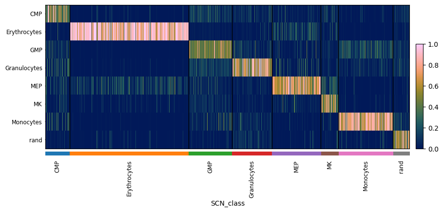
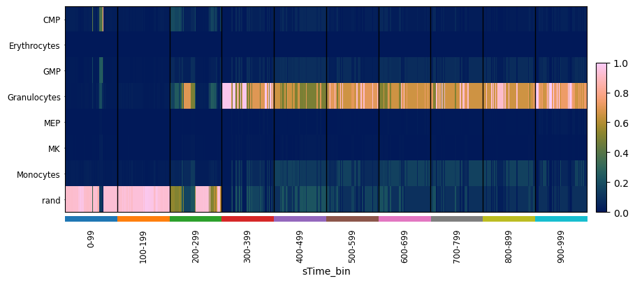
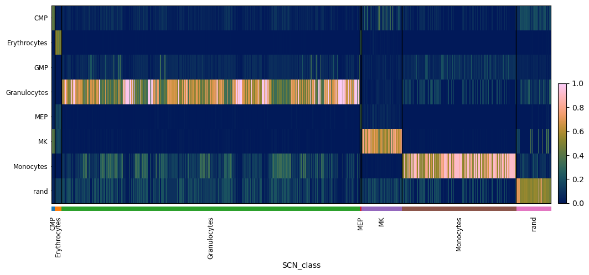
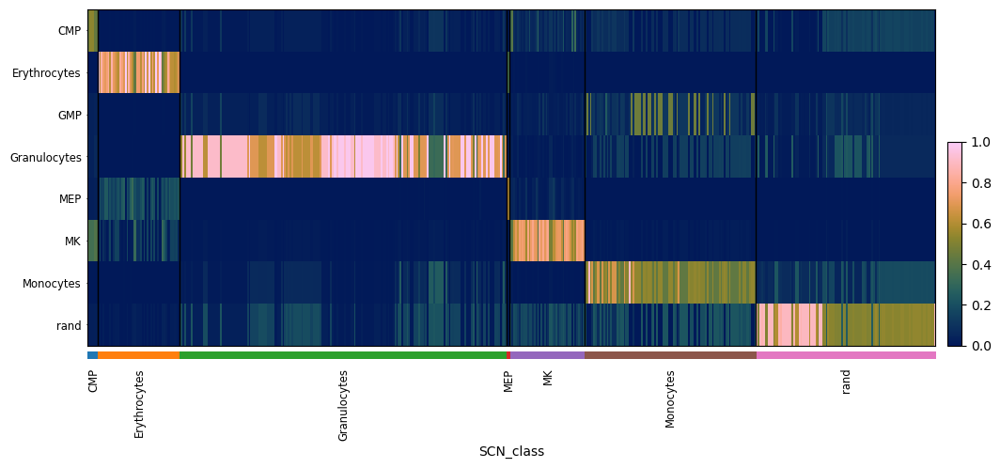
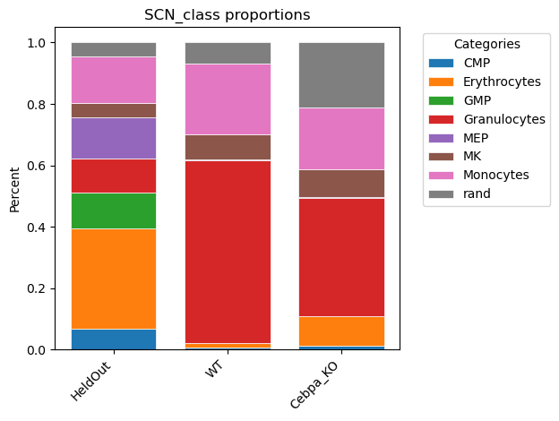

# Simulation of Synthetic Cells (AnnData Object)

### Building OneSC simulator 
After the inference of GRNs from [previous step](infer_grn_scanpy.md), we can perform simulations using the GRN as a backbone. For all simulations, we need to define the start state. In our case, we know that cells start in the CMP state. To determine the Boolean state of genes in the CMP state, we subset the adata to those cells and then apply thresholds on the mean expression and the percent of cells in which the gene is detected:
```
adCMP = adata[adata.obs['cell_types'] == 'CMP'].copy()
xstates = onesc.define_states_adata(adCMP, min_mean = 0.05, min_percent_cells = 0.20) * 2 
```
Now we construct a OneSC simulator object:
```
netname = 'CMPdiff'
netsim = onesc.network_structure()
netsim.fit_grn(iGRN)
sim = onesc.OneSC_simulator()
sim.add_network_compilation(netname, netsim)
```
### Simulate wildtype trajectory 
Finally we are ready to simulate expression state trajectories using our GRN. Note that the `simulate_parallel_adata` function has been tested on MacOS (m1 chip) and Ubuntu, it may or may not work on Windows. 

- OneSC_simulator: exactly that, the OneSC simulator object to use. 
- initial_exp_dict (dict): dictionary of initial state values.
- initial_subnet (str): the name of the gene regulatory fitted network structure that the user want to use for simulation. 
- perturb_dict (dict, optional): a dictionary with the key of gene name and value indicating the in silico perturbation. If the user want to perform overexpression, then set the value between 0 and 2. If the user want to perform knockdown, then set the value between 0 and -2. Defaults to dict().
- num_runs (int, optional): number of simulations to run. Defaults to 10.
- n_cores (int, optional): number of cores for parallel computing. Defaults to 2.
- num_sim (int, optional): number of simulation steps. Defaults to 1000.
- t_interval (float, optional): the size of the simulation step. Defaults to 0.01.
- noise_amp (int, optional): the amplitude of noise. Defaults to 0.1

```
simlist_wt = onesc.simulate_parallel_adata(sim, xstates, netname, n_cores = 8, num_sim = 1000, num_runs = 32, t_interval = 0.1, noise_amp = 0.5)
```
`simulate_parallel_adata` returns a list of annData objects. Each annData contains `num_sim` simulated cells starting at the `initial_exp_dict` state, and progressing subject to the regulatory constraints defined by the provided GRN modulated by randomly generated noise (if allowed). Each annData has .obs['sim_time']. 

### Setup PySCN for classification 
We will use PySCN to annotate the states of the simulated cells. Train the classifer now:
```
adTrain_rank, adHeldOut_rank = pySCN.splitCommonAnnData(adata, ncells=50,dLevel="cell_types")
clf = pySCN.train_rank_classifier(adTrain_rank, dLevel="cell_types")
```
Classify held out data:
```
pySCN.rank_classify(adHeldOut_rank, clf)
pySCN.heatmap_scores(adHeldOut_rank, groupby='SCN_class')
```

Note: the function `train_rank_classifier()` ranks transforms training and query data instead of TSP. Be forewarned that it is likely to be slow if applied to adata objects with thousands of genes. 

### Classify Simulated Cells 
Let's look at the transcriptomic states over sim_time for one simulated trajectory. We will classify the cells first, and then visualize
```
ad_sim1 = simlist_wt[0].copy()
pySCN.rank_classify(ad_sim1, clf)

# a hack because sc.pl.heatmap requires a 'groupby', so groupby simulation time bin
tmp_obs = ad_sim1.obs.copy()
bins = np.linspace(-1, 999, 11)
labels = [f"{int(bins[i]) + 1}-{int(bins[i+1])}" for i in range(len(bins)-1)]

tmp_obs['sTime_bin'] = pd.cut(tmp_obs['sim_time'], bins=bins, labels=labels)
ad_sim1.obs = tmp_obs

pySCN.heatmap_scores(ad_sim1, groupby = 'sTime_bin')
```

Instead of looking the trajectory of a single cell, we can sample the end stages of all simulations:
```
ad_wt = onesc.sample_and_compile_anndatas(simlist_wt, X=50, time_bin=(80, 100), sequential_order_column='sim_time')
pySCN.rank_classify(ad_wt, clf)
pySCN.heatmap_scores(ad_wt, groupby = 'SCN_class')
```


### Simulate knockout trajectory 
Now, let's simulate a trajectory of a cell in which Cebpa is knocked out
```
perturb_dict = dict()
perturb_dict['Cebpa'] = -1 
simlist_cebpa_ko = onesc.simulate_parallel_adata(sim, xstates, 'CMPdiff', perturb_dict = perturb_dict, n_cores = 8, num_sim = 1000, t_interval = 0.1, noise_amp = 0.5)
```
Now fetch the simulated cells, sampling from the end stages, classify them, and visualize the results.
```
ad_cebpa_ko = onesc.sample_and_compile_anndatas(simlist_cebpa_ko, X=50, time_bin=(80, 100), sequential_order_column='sim_time')
pySCN.rank_classify(ad_cebpa_ko, clf)
pySCN.heatmap_scores(ad_cebpa_ko, groupby = 'SCN_class')
```

We can also directly compare the proportions of cell types across simulations/perturbations as follows:
```
pySCN.plot_cell_type_proportions([adHeldOut_rank,ad_wt, ad_cebpa_ko], obs_column = "SCN_class", labels=["HeldOut", "WT","Cebpa_KO"])
```
